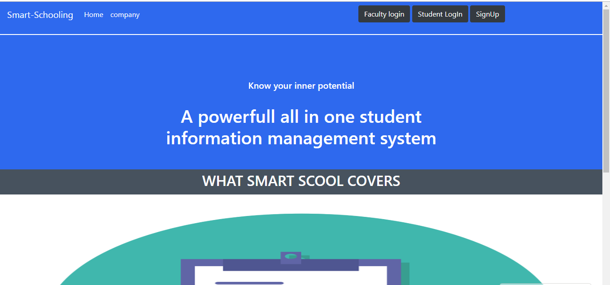
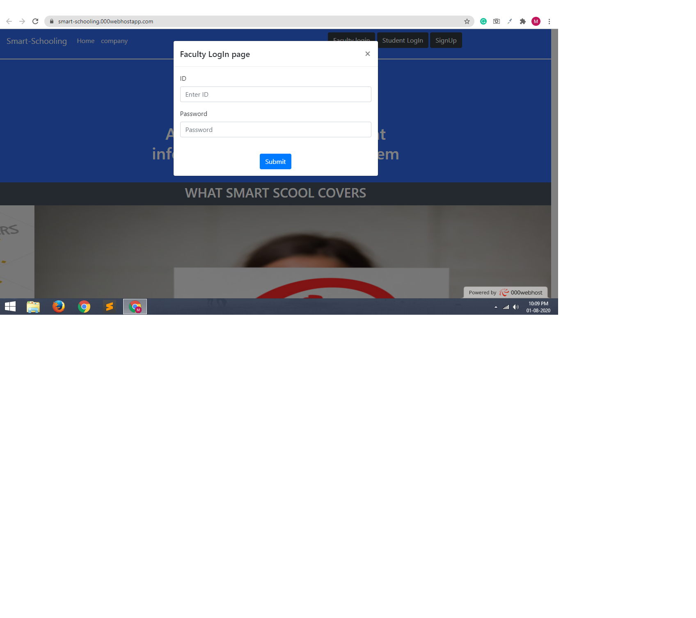
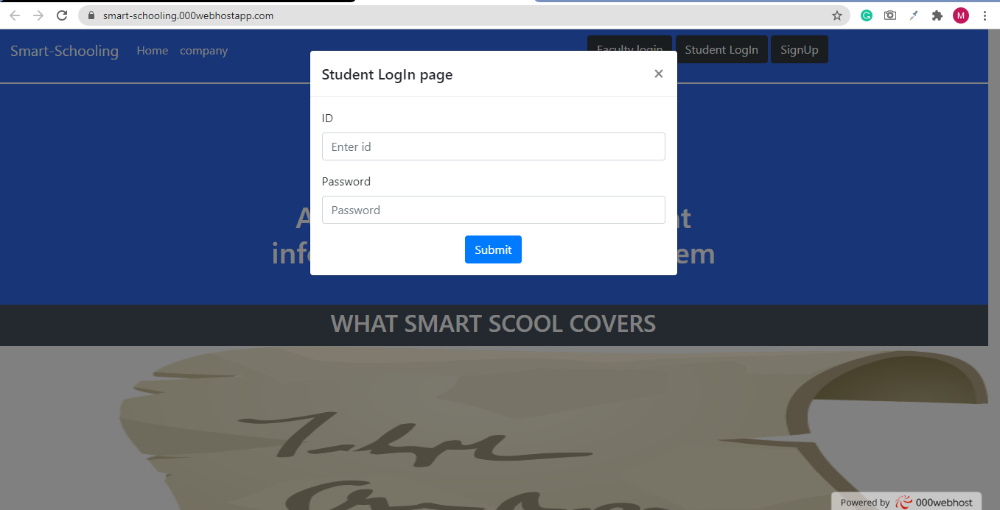
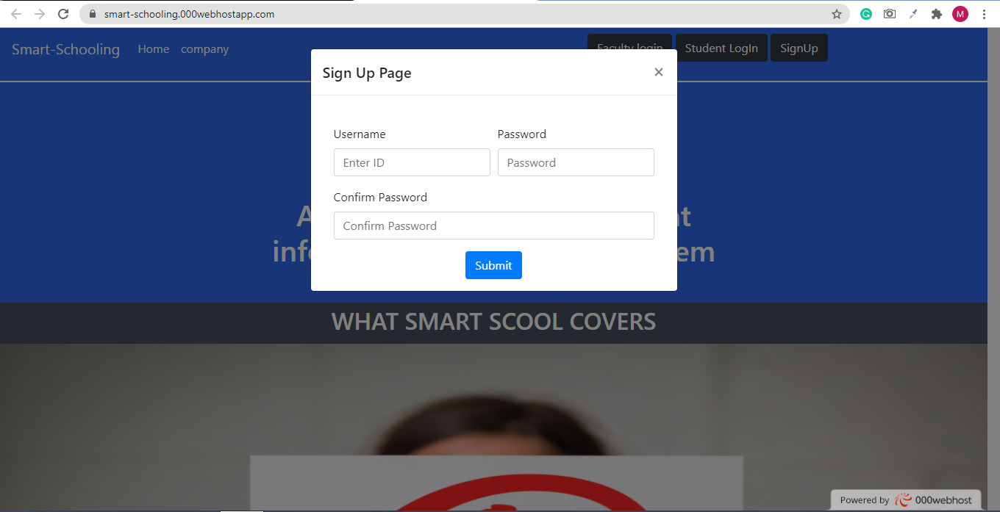
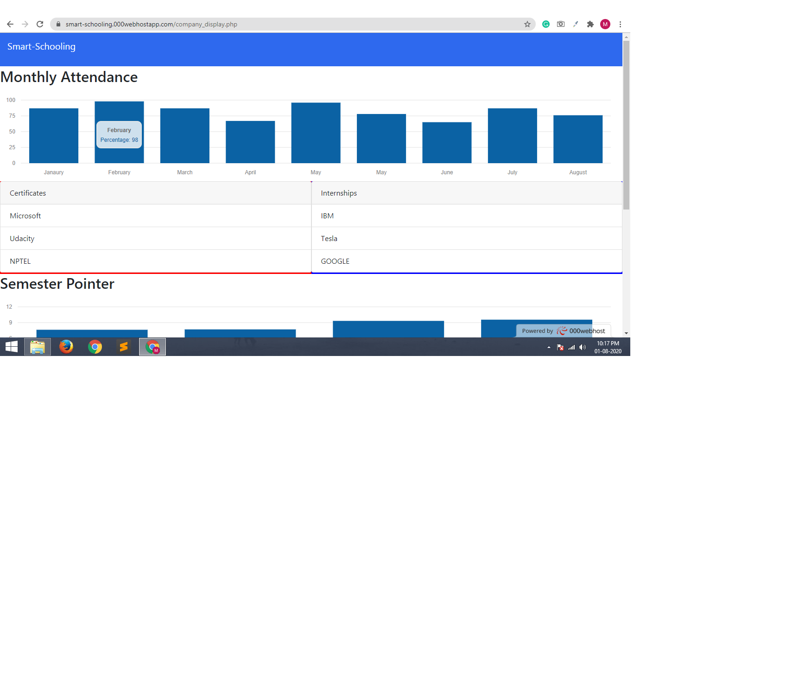
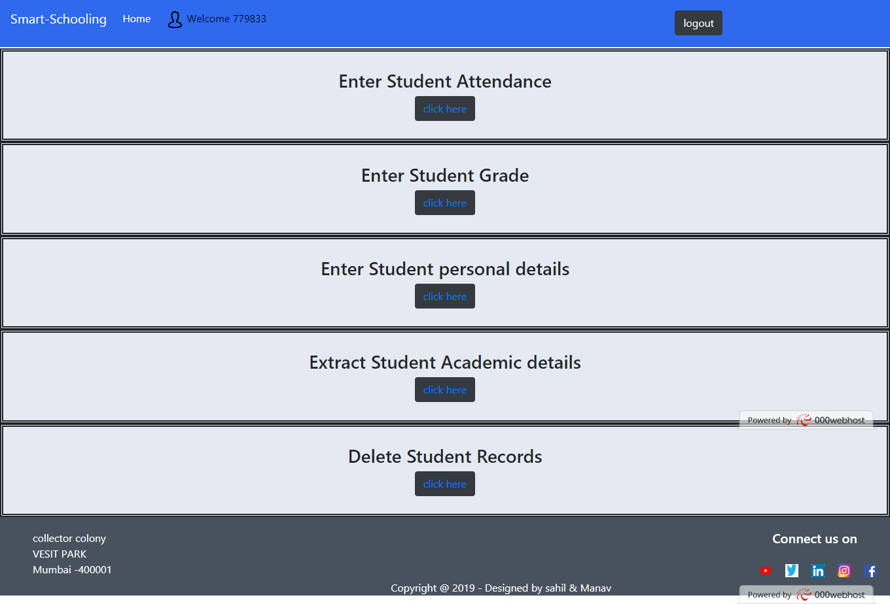

# Student-Data-management
Smart-Schooling a PHP based website which is for
A) Students – They can enter their Internships, Achievements, Certificates,
etc.
B) Teachers – They can enter student’s contact details, monthly
Attendance, CGPA, etc.
C) Companies – They can verify Student’s Certificates, CGPA, they can
get their contact details. They just have to enter student’s unique id
(e.g. Library Card Number) all details of that student will be in front of
them in form of interactive charts.
# Screenshots of Website
# Landing Page

# Faculty Login

# Student login

# SignUp Page

# Company Display Page

# Faculty Dashboard

